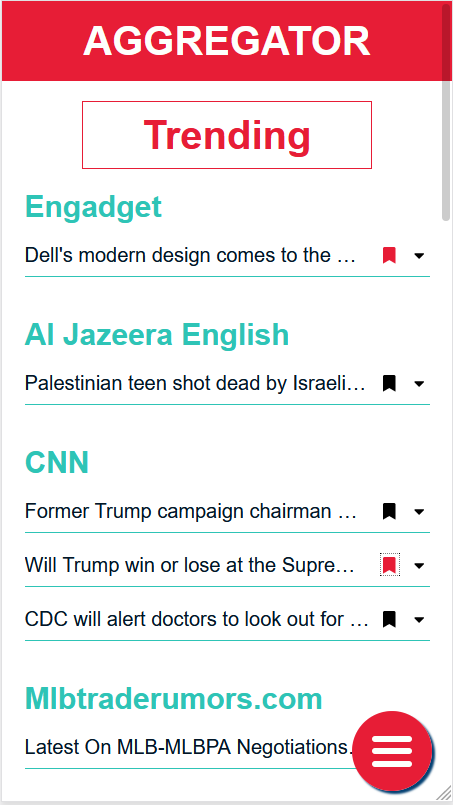
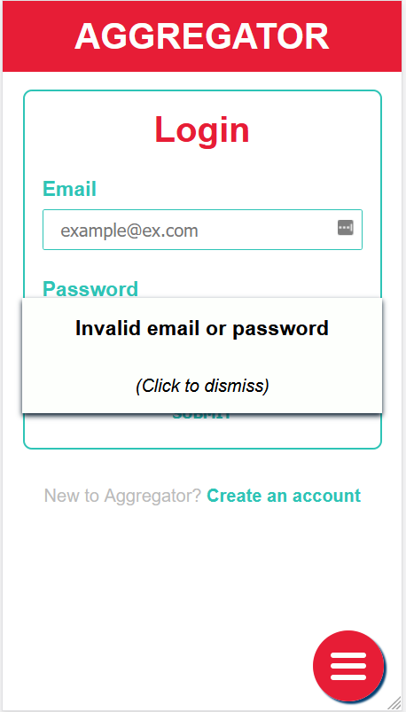
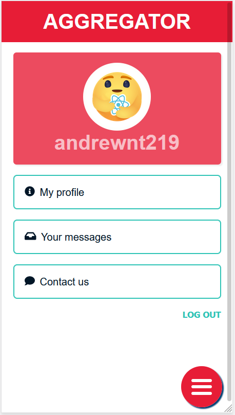
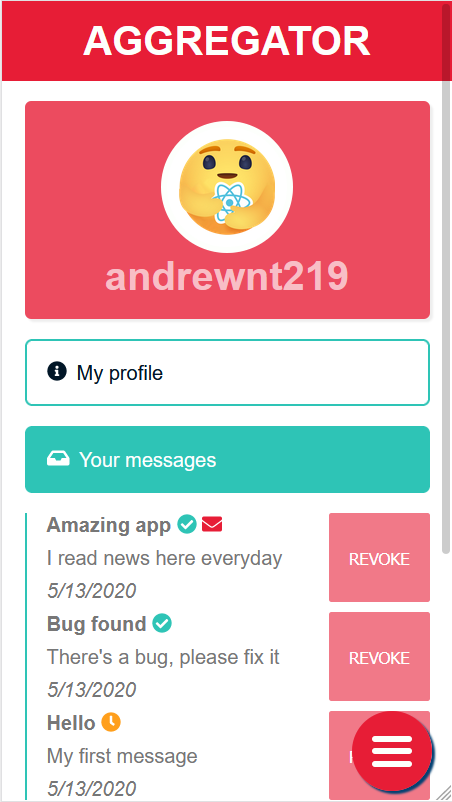
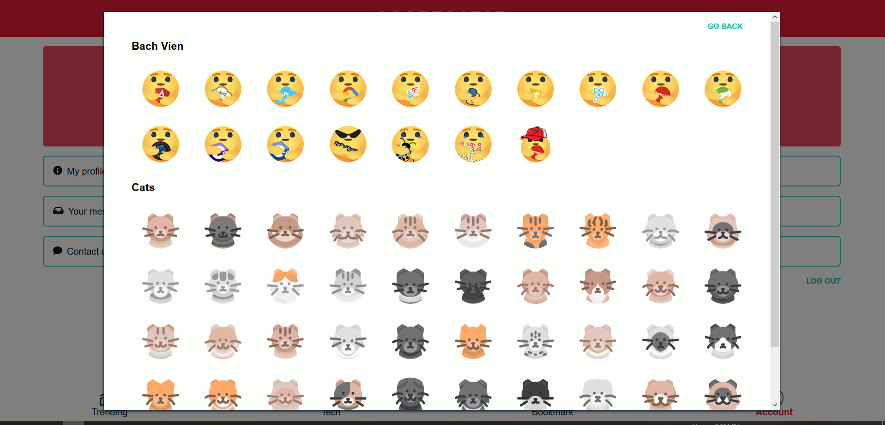
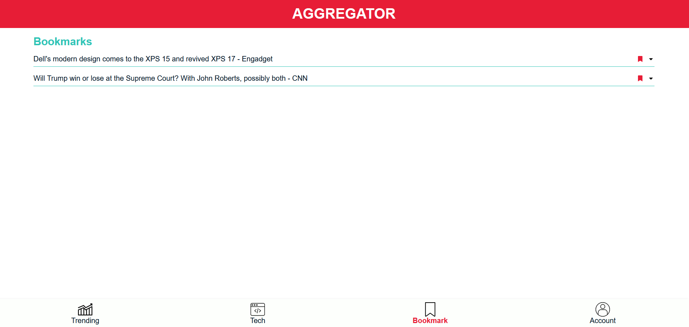
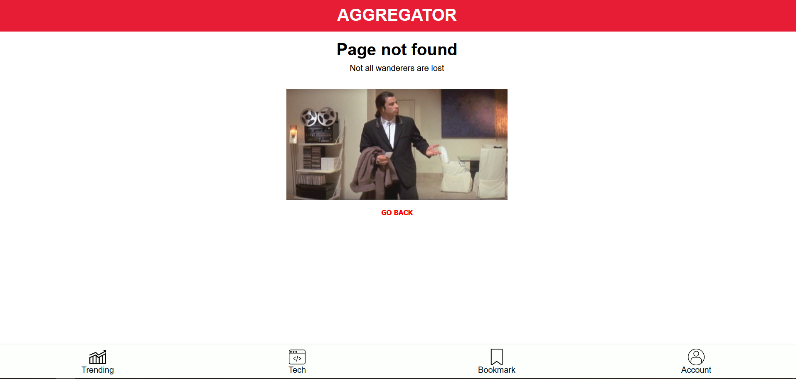

This project was bootstrapped with [Create React App](https://github.com/facebook/create-react-app), using the [Redux](https://redux.js.org/) and [Redux Toolkit](https://redux-toolkit.js.org/) template.

Special thanks to [NewsApi](https://newsapi.org/) for their amazing API.

Project is hosted on Heroku at https://react-aggregator.herokuapp.com/

## Libraries & Frameworks

### `React`

- Developed using React Hooks.

- Clearly defined hierarchy in file structure.

- Granular and reusable components.

- Applied custom hooks and HOC. 
- Code Splitting

### `Redux`

- Leveraged hooks and `Immer` to simplify code
- Separated async actions with `redux-thunk`
- Synced bookmarks state across the app
- Debugged using Redux Dev Tools in development mode

### `React Router`

- Redirect to login upon accessing protected resources.
- Return user's to exact protected route after successfully logging in
- 404 page

### `React-hook-form`

- Implemented controlled input.
- Visually responding  errors to user.

### `framer-motion`

- Used in modals and SideDrawer for a smoother user's experience

### `SCSS module`

- Utilized module local scope and scss' functions for better rules management
- Mobile first, responsive design

### `Firebase`

- User's info and bookmarks are stored in Firebase' real time database.
- Utilized `localStorage` to retain user's authentication status.

## Aggregator

### Features

- Aggregating news from lots of sources
- Signing in to bookmark news
- Messaging the developer through built-in chat system
- Choosing your favorite avatars
- Friendly UI on all your devices

### Screenshot

